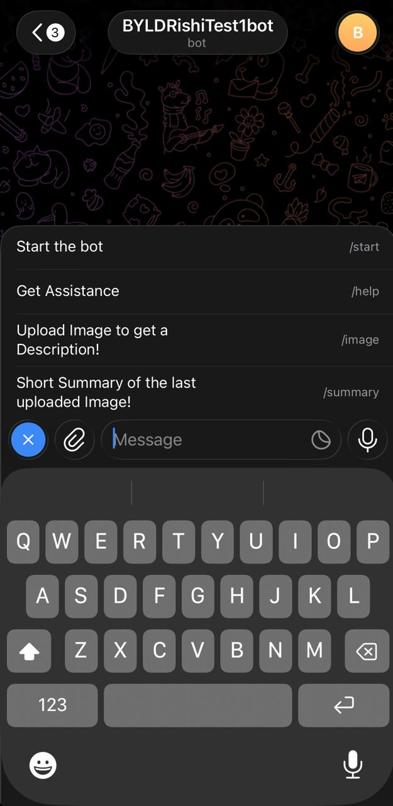
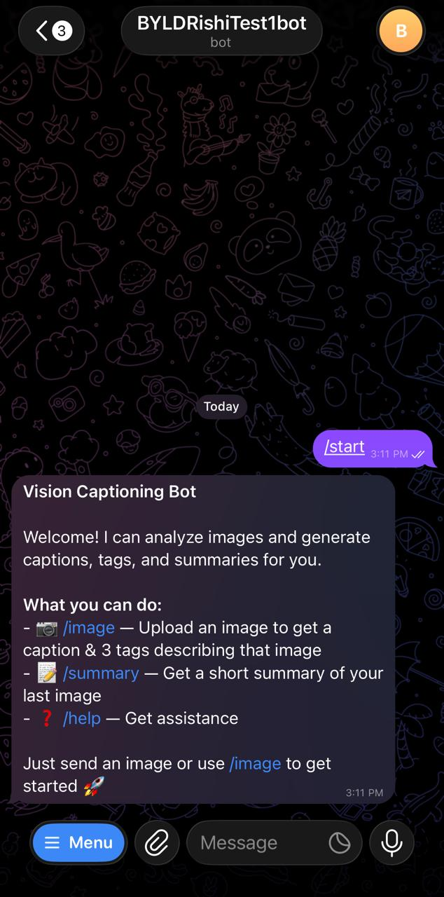
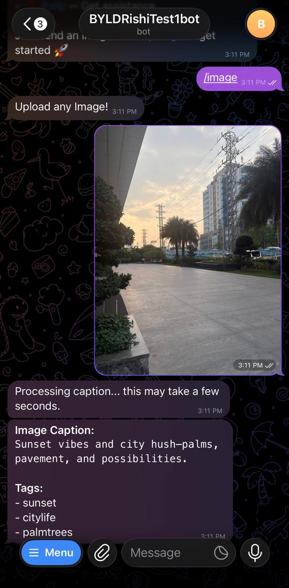
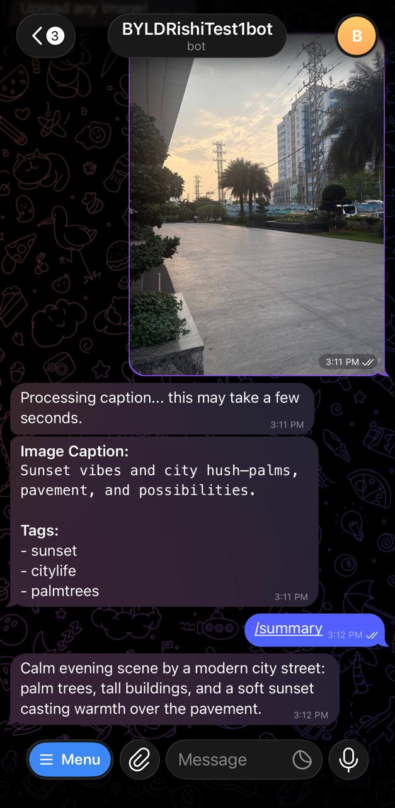

# 🤖 AI Image Captioning Telegram Bot

## Overview

This project is a Telegram bot that analyzes images and generates:

* 📝 Short, meaningful captions
* 🏷️ Relevant tags (keywords)
* 📄 Optional summaries

It leverages LLMs for intelligent image understanding and provides a simple conversational interface via Telegram.

---

## ✨ Features

### 📷 Image Understanding

* Generates **concise captions (≤20 words)**
* Extracts **3 meaningful tags**
* Supports diverse real-world images

### 🤖 LLM-Powered Processing

* Uses OpenAI GPT models via LangChain
* Optimized prompts for structured output
* Fast and token-efficient responses

### ⚡ Telegram Integration

* Simple commands:

  * `/image` → upload image for caption + tags
  * `/summary` → get summary
* Clean formatted responses (HTML/Markdown)

### 🐳 Dockerized Deployment

* Fully containerized using Docker
* Easy setup with Docker Compose
* Environment-based configuration

---

## 🧱 Tech Stack

* **Backend**: Python 3.12
* **Frameworks**: python-telegram-bot, LangChain
* **LLM API**: OpenAI
* **Containerization**: Docker, Docker Compose

---
## Setup

### 📝 Create Telegram Bot

1. Contact [@BotFather](https://t.me/BotFather) on Telegram
2. Create a new bot: `/newbot`
3. Follow the prompts to set up your bot
4. Copy the bot token

## 🔐 Environment Variables

Create a `.env` file:

```bash
cp .env.example .env
```

Add your credentials:

```env
BOT_TOKEN=your_telegram_bot_token
OPENAI_API_KEY=your_openai_api_key
```

---

## ▶️ Running the Application

### 🔹 Run Locally

```bash
uv sync
python -m app.main
```

---

### 🐳 Run with Docker

```bash
docker build -t aiagents .
docker run --env-file .env aiagents
```

---

### 🐳 Run with Docker Compose

```bash
docker compose up --build
```

---

## 🧠 Models & APIs Used

* **OpenAI GPT models** → caption & tag generation
* **LangChain** → structured LLM interaction
* **Telegram Bot API** → messaging interface

---

## 🏗️ System Architecture

### 🔹 High-Level Flow


---

### 🔹 Logical Components

* `main.py` → Entry point
* `handler/` → Request routing (image)
* `utils.py` → Processing logic with LLM Invoke
* `imageModel.py` → LLM Response Interaction

---

## 🔄 Data Flow

1. User sends image via Telegram
2. Telegram forwards update to bot
3. Bot routes request to handler
4. Handler processes input
5. Model calls OpenAI API
6. Caption + tags + summary generated
7. Response sent back to user


---

## 🎥 Demo (Screenshots)

Bot Menu

### Bot Menu


### Start Command


### Image Command


### Summary Command


---

## 🧪 Future Improvements

* Integrate local vision models (LLaVA / BLIP2)
* Switch to webhook-based deployment using FastAPI
* Allow users to rate responses (👍/👎) and optionally provide corrections
* Multimodal Query Support - Image Captioning + Mini RAG
